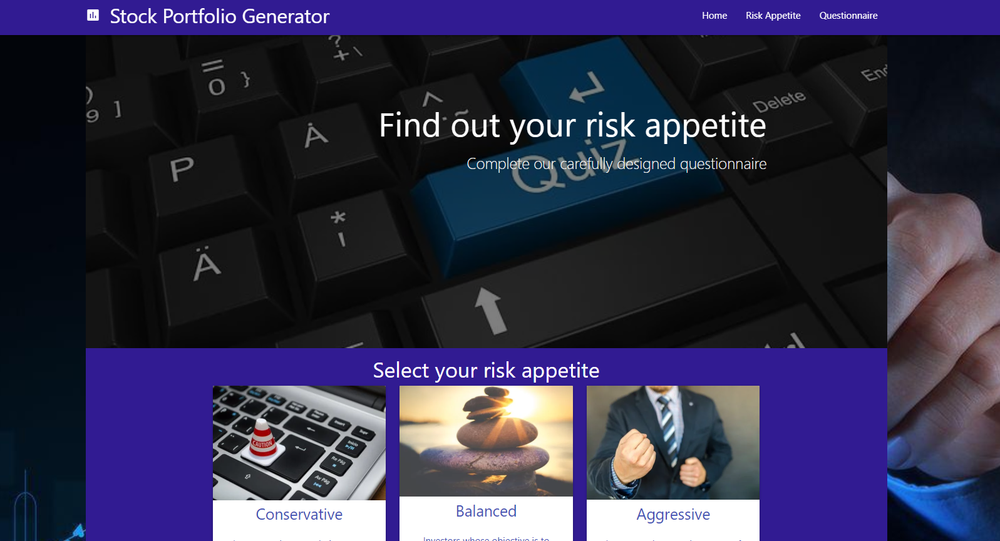

# Asset-Portfolio-Generator

## About The Page ## 
We created an application that when l open the app, I am presented with a selection of conservative, balanced or aggressive risk tolerance options;
If l know my risk tolerance, I select an option that aligns with my risk tolerance and l am presented with stocks that align my risk profile; 
If l don’t know my risk profile, I select the option to participate in a quiz that is designed to determine my risk tolerance based on a set of carefully selected questions and a set algorithm; 
Once my risk tolerance is determined from quiz, I am presented with a selection of stocks that align my risk profile;
When l click on each stock suggestion, I am presented with top news stories about my recommended stocks;

We used the Materialize css framework, yahoo finance API and news API for the stock news articles

We had exposure to different github functions as we created issues and assigned them to make sure workflow was suitable and the job was completed on time by using the projects function.

Pull requests were also used by us for the first time as we had a number of different branches that we needed to merge into master without causing any integration problems

## Stock Portfolio Page ##

## HTML Screenshot ## 

## JS Screenshot ##

## Collaborators ## 

Pete331
MwansaMwango

## Built With ##

    HTML 
    CSS 
    Bootstrap
    VS Code
    Javascript
    Yahoo API
    News API

### Installation ###

    Clone the repo

git clone https://github.com/Mitchelle-B/repo.git

## Contributing ##

    Fork the Project
    Create your Feature Branch (git checkout -b feature/AmazingFeature)
    Commit your Changes (git commit -m 'Add some AmazingFeature')
    Push to the Branch (git push origin feature/AmazingFeature)
    Open a Pull Request

## License ##

Distributed under the MIT License. See LICENSE for more information.
Contact

Project Link: https://github.com/Mitchelle-B/repo

## Acknowledgements ##

UWA Coding Bootcamp 